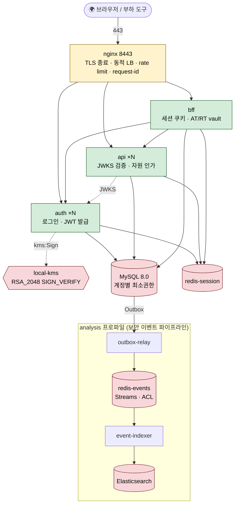

# 🛡️ ZETTY — Zero Trust Architecture (인프라 본체)

> **아주대 캡스톤 / Google × Ajou AI Capstone Design**
> 2025년 쿠팡 JWT 키 유출 사고 재현 + 이상 탐지·대응 PoC 의 **인프라 스택**

[](#)
[](#)
[](#)
[-7B42BC.svg)](#)

---

## ⚡ 30초 요약

이 레포는 ZETTY 데모의 **인프라 본체**다. 두 층으로 구성된다.

1. **로컬 Compose 스택** (`compose/`) — 현재 활성 인프라. AWS 없이 `docker compose up` 하나로 인증 기반(Auth·API·BFF)과 로컬 KMS·MySQL·Redis·nginx 로드 밸런서를 기동하고, 프로파일로 관측(Prometheus·cAdvisor)과 보안 이벤트 파이프라인(Outbox → Redis Streams → ES)을 켠다.
2. **AWS Terraform IaC** (`terraform/`) — 콘솔로 수기 구성했던 AWS 배포를 코드로 정리한 **설계 아카이브**. 자세한 내용은 [`terraform/README.md`](./terraform/README.md).

> 💡 **시연 스토리**: 쿠팡 사고 조사 → **하드코딩 서명키 문제 발견** → **KMS 전환**으로 선제 차단 → 그래도 키가 유출됐을 경우 대비해 **보안 이벤트를 남기고 이상 탐지로 사후 탐지**(탐지 본체는 `log-pipeline`, 대응 집행은 `backend` I-04). 본 레포는 그 **인프라 토대**.

---

## 🏗️ 1. 로컬 Compose 스택 (활성 인프라)



### 네트워크 분리 (compose networks)

| 네트워크 | 붙는 서비스 | 의도 |
|---|---|---|
| `application` | nginx · auth · api · bff · redis-session | 앱 트래픽 |
| `data` | mysql · relay · indexer · exporter | DB 접근 |
| `kms` | kms · kms-init · **auth 만** | 서명키는 auth 만 접근 |
| `analysis` | redis-events · elasticsearch · relay · indexer | 이벤트 파이프라인 격리 |

> 외부 진입은 `https://127.0.0.1:8443`(nginx) **하나뿐**이다. DB·Redis·KMS·API 포트는 host에 열지 않는다. 서명키는 `kms` 컨테이너에만 있고 `auth` 만 `kms` 네트워크에 연결된다(에뮬레이터가 IAM을 강제하지 않으므로 **권한 경계를 네트워크 분리로 구현**).

### 구성 요소 (프로파일별)

| 프로파일 | 서비스 | 역할 |
|---|---|---|
| **core** (기본) | `kms` + `kms-init` | local-kms 에뮬레이터에 `RSA_2048` 서명키 + `alias/zetty-jwt-signing` 멱등 생성 |
| | `mysql` | MySQL 8.0. 계정 분리(`auth_app` · `api_app` · `bff_app` + 파이프라인/exporter 전용 최소권한) |
| | `redis-session` | 세션·인증 상태 캐시 |
| | `auth` · `api` · `bff` | backend 저장소 Dockerfile로 build. auth=JWT 발급, api=JWKS 검증+자원 인가, bff=세션 쿠키 진입점 + AT/RT 암호화 vault(MySQL) |
| | `nginx` | 8443 TLS 종료 · 동적 LB(Docker DNS 재조회) · 로그인 rate limit(429) · request-id(UUID v4) |
| **observability** | `prometheus`(9091) · `cadvisor` · `mysqld-exporter` | 부하 측정용 지표 수집(Hikari·Tomcat·JVM·컨테이너·MySQL) |
| **analysis** | `redis-events` · `elasticsearch` · `outbox-relay` · `event-indexer` | 보안 이벤트 전달(Outbox → Redis Streams → ES). relay·indexer는 `log-pipeline` 저장소 build |
| **lab** | `auth-lab`(127.0.0.1:8444) | 공격자가 KMS Sign 권한을 얻은 상황(대장 미기록 위조 토큰) 재현 |

### 기동

```sh
cd compose
./scripts/gen-secrets.sh     # .secrets/env, mysql-init(계정+최소권한 grant + Redis ACL) 생성
./scripts/gen-tls.sh         # tls/ 로컬 인증서 생성
docker compose --env-file .secrets/env up -d --build --wait

# 관측(부하 측정용): --profile observability
# 이벤트 파이프라인:  --profile analysis
```

- `.secrets/`, `tls/` 는 Git에 올리지 않는다(자격증명·키).
- backend·log-pipeline 저장소를 **형제 디렉터리**로 checkout한 상태를 전제한다(`BACKEND_PATH`·`LOG_PIPELINE_PATH` 로 재지정 가능).
- 상세 기동·smoke·Swagger 경로: [`compose/README.md`](./compose/README.md).

---

## 🔐 2. Zero Trust 통제 매핑

전통적 perimeter 방어는 방화벽(L3~L4)에 의존한다. ZETTY는 **모든 hop에서 검증하고, perimeter가 뚫린 뒤(assume breach)까지 관측**한다. 아래는 현재 Compose 스택 기준.

| ZT 원칙 | 이 스택에서의 구현 |
|---|---|
| **Verify explicitly** | edge(nginx) TLS 종료 · request-id 재발급(클라이언트 헤더 무시) → Auth 로그인 → **JWT RS256 서명(KMS)** → API가 Auth의 **JWKS로 검증** + `sub` 기반 **자기 자원 인가** |
| **Least privilege** | 네트워크 분리(서명키는 `auth` 만) · MySQL 계정별 최소권한(producer=Outbox INSERT만, relay=SELECT+상태 UPDATE, indexer=receipt SELECT/INSERT) · redis-events **ACL 사용자별 권한**(default 사용자 끔) |
| **Assume breach** | 정상 토큰·정상 경로를 통과한 트래픽까지 **보안 이벤트로 기록** → `analysis` 파이프라인으로 ES 적재(유실·중복 0 검증, Z-05) → **`log-pipeline`의 이상 탐지(IsolationForest) + `anomaly_incident` LLM 보고** → **`backend` I-04 대응 집행**. `auth-lab`으로 키 탈취 시나리오를 재현해 탐지 가능성을 검증 |

### 키·자격증명 격리

| 영역 | 통제 |
|---|---|
| **서명키** | RSA 개인키는 `kms` 컨테이너 `/data` 볼륨에만 존재. 앱은 서명 API만 호출(개인키 미노출), 검증은 공개키(JWKS)만으로 수행 |
| **BFF 토큰 vault** | 브라우저는 세션 쿠키만 받고 AT/RT는 BFF의 **암호화 vault(MySQL)** 에만 둔다(`BFF_VAULT_KEY`) |
| **비밀 전달** | 파이프라인 자격증명은 compose `secrets`(`*_FILE`)로 주입. `.secrets/`·`tls/` 는 gitignore |
| **이벤트 민감정보** | ES 문서에 토큰·비밀번호·이메일 원문 없음(actor는 HMAC 가명 키, 경로는 템플릿) — Z-05 검증 |

---

## ☁️ 3. AWS 배포 설계 (Terraform IaC · 아카이브)

`terraform/` 는 콘솔로 수기 구성했던 AWS 배포(단일 VPC Multi-AZ)를 코드로 정리한 **설계 아카이브**다. `apply`가 아니라 IaC 정리 목적이며, 현재 활성 인프라는 위의 Compose 스택이다.

- 모듈: `vpc` · `security_groups` · `alb` · `waf` · `route53` · `ec2` · `rds` · `kms`(ES256/ECC_NIST_P256)
- L3~L7 다층 방어 설계(VPC 격리 · ZT SG 체인 · ALB TLS1.3 · WAFv2 Managed Rules · KMS 암호화)
- 상세·모듈 구조·import 절차: [`terraform/README.md`](./terraform/README.md)

> 초기 AWS 설계에는 ELK/관제 EC2가 포함돼 있으나, 이는 폐기된 v1 관제 흔적이다. 현재 탐지는 `log-pipeline`의 이상 탐지(v2)로 이관됐다.

---

## 🔗 4. 관련 레포 (ZETTY-ZEROTRUST Org)

| 레포 | 역할 |
|------|------|
| [backend](https://github.com/ZETTY-ZEROTRUST/backend) | auth·api·bff (JWT 발급/검증, KMS 서명, BFF 세션 vault) + **I-04 대응 집행** |
| [log-pipeline](https://github.com/ZETTY-ZEROTRUST/log-pipeline) | 보안 이벤트 파이프라인(Outbox → Redis Streams → ES) + **v2 이상 탐지(IsolationForest)** + `anomaly_incident` LLM 보고 + 학습 노트북 |
| [attack-simulation](https://github.com/ZETTY-ZEROTRUST/attack-simulation) | 공격·부하 시나리오 시뮬레이터 |
| **zero-trust-architecture** *(this)* | **로컬 Compose 인프라 스택 + AWS Terraform IaC 설계** |

---

## 📓 5. 작업 기록 (STAR)

착수 전 설계와 결과를 STAR(S=문제 / T=목표 / A=방법 / R=실측)로 남긴다 → [`docs/star/`](./docs/star/).

| ID | 제목 | 상태 |
|---|---|---|
| [Z-01](docs/star/Z-01-local-kms.md) | 로컬 KMS 에뮬레이터로 AWS 의존 제거 | 완료 |
| [Z-02](docs/star/Z-02-compose-core.md) | Compose core: 네트워크 분리·자원 상한·기동 순서 | 완료 |
| [Z-03](docs/star/Z-03-observability.md) | 부하 측정을 위한 관측 스택 | 완료 |
| [Z-04](docs/star/Z-04-load-balancing.md) | 수평 확장·nginx 동적 LB·로그인 과부하 제한 | 진행 |
| [Z-05](docs/star/Z-05-event-pipeline-integration.md) | 보안 이벤트 파이프라인 통합(유실·중복 0) | 완료 |

---

## 📜 컨벤션

- Commit message: [COMMIT_CONVENTION.md](./COMMIT_CONVENTION.md) (한글 subject + scope 명시)
- 실험 자산 경계: 순차 `sub`, `door_password` 응답, MOCK OTP와 문서화된 키 유출 재현 자산은 유지하되, 자원 API의 소유권 검사는 모든 profile에서 적용.
