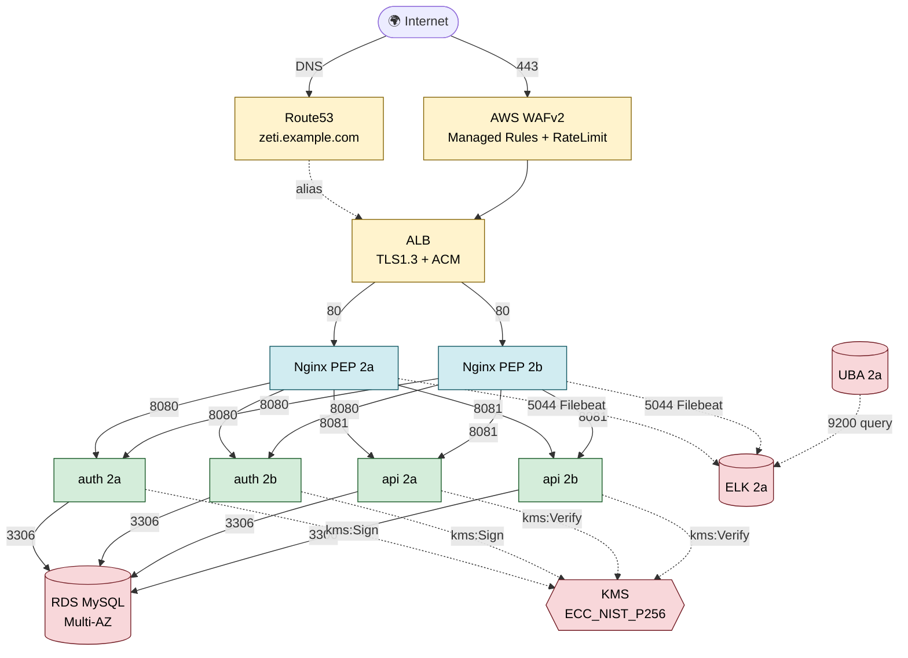

# 🛡️ ZETI — Zero Trust Architecture

> **ZETI (Zero Trust + UBA) — 아주대 캡스톤 / Google × Ajou AI Capstone Design**
> 2025년 쿠팡 JWT 키 유출 사고 재현 + UBA 기반 탐지 PoC 의 **인프라 본체** (IaC)

[](#)
[](#)
[](#)
[](#)
[](#)

---

## ⚡ 30초 요약

본 레포는 **ZETI 의 클라우드 인프라 전체를 Terraform 으로 정의** 한 IaC 본체입니다. 콘솔로 수기 구성된 AWS 자원을 ground truth 로 코드화하고, 여기에 **Route53 + WAFv2 + ACM** 을 ALB 앞단에 추가해 **OSI L3~L7 다층 방어** 를 구현합니다.

- 🏗️ **VPC Multi-AZ** — 단일 ZETI-VPC (10.0.0.0/16) × 5 tier × 2 AZ = subnet 10개
- 🚦 **ZT SG 체인** — `alb → nginx → app → db` 인바운드는 SG ID 참조 only (IP 무관)
- 🌐 **ALB + WAFv2 + Route53 + ACM** — L7 WAF Managed Rules + L6 TLS1.3 + L4 rate limit
- 🔑 **KMS ES256 비대칭** — auth-server `kms:Sign` / api-server `kms:Verify` 권한 분리
- 🗄️ **RDS MySQL 8.4 Multi-AZ** — KMS 암호화 + priv-db tier 격리 + deletion protection
- 📦 **9 Terraform modules** — vpc / security_groups / alb / waf / route53 / ec2 / rds / kms (+ root wiring)

> 💡 **시연 스토리**: 쿠팡 사고 조사 → **KMS 키 관리 문제 발견** → KMS 전환으로 **선제적 차단** → 그래도 키가 유출됐을 경우 대비해 **UBA 사후 탐지**. 본 레포는 그 **인프라 토대**.

---

## 🎬 Live Demo — Terraform 사용

```bash
cd zero-trust-architecture/terraform

cp terraform.tfvars.example terraform.tfvars   # 시크릿 값 채우기
terraform init
terraform plan
# terraform apply   # 콘솔 자원 중복 방지를 위해 import 먼저 (아래 참조)
```

---

## 🏗️ 1. 아키텍처 한눈에



### Tier 별 CIDR (ground truth)

| Tier | CIDR (AZ-2a / 2b) | 워크로드 | 인바운드 from |
|------|--------------------|---------|---------------|
| **public** | 10.0.1.0/24 / 10.0.2.0/24 | ALB · NAT GW | Internet (80/443) |
| **priv-web** | 10.0.11.0/24 / 10.0.12.0/24 | Nginx PEP | sg-alb (80) |
| **priv-app** | 10.0.21.0/24 / 10.0.22.0/24 | auth · api | sg-nginx (8080 · 8081) |
| **priv-db** | 10.0.31.0/24 / 10.0.32.0/24 | RDS Multi-AZ | sg-app (3306) |
| **priv-monitor** | 10.0.41.0/24 / 10.0.42.0/24 | ELK · UBA | sg-nginx · sg-uba (5044 · 9200) |

---

## 🧱 2. OSI 7 레이어별 공격 방어 매핑 ★

ZT 의 핵심 원칙인 **defense in depth** — 한 layer 가 뚫려도 다음 layer 가 막는다. ZETI 가 각 레이어에서 어떤 위협을, 어떤 컴포넌트로 막는지 정리.

| OSI Layer | 대표 위협 | ZETI 방어 컴포넌트 | Terraform 모듈 |
|----|-----|-----|-----|
| **L7 Application** | SQLi · XSS · CSRF · 알려진 nasty payload · IDOR 자동화 · JWT 위조 · 봇 트래픽 | **WAFv2 Managed Rules** 3종 (CommonRuleSet · KnownBadInputs · SQLi) + **Nginx PEP** path 필터 + **JWT KMS ES256 검증** + **UBA 행위 분석** (LSID 추적 · 7개월 저속 유출 탐지) | `waf` · `kms` · (UBA 자체는 `uba-analyzer` 레포) |
| **L6 Presentation** | TLS downgrade · weak cipher · MITM · 키 평문 노출 | **ACM cert** (DNS validation) + **ALB ssl_policy `ELBSecurityPolicy-TLS13-1-2-2021-06`** + **JWT ES256 비대칭** (서명키 KMS HSM 안에서만 사용) | `route53` · `alb` · `kms` |
| **L5 Session** | 세션 탈취 · 동일 세션 다중 IP abuse · 토큰 재사용 | **JWT TTL 600s** (단명 토큰) + **`ext.LSID` 세션 추적자** + **UBA 동일 LSID + 복수 IP 탐지** | `kms` (서명) + UBA |
| **L4 Transport** | 포트 스캐닝 · 백엔드 직접 접근 · 자동화 폭주 | **Security Group 체인** (SG ID 참조, port 화이트리스트) + **WAF rate-based rule** (IP 당 5분 윈도우 2000req → BLOCK) | `security_groups` · `waf` |
| **L3 Network** | 횡적 이동 · priv subnet 직접 접근 · 외부 C2 콜백 | **VPC CIDR 격리** (10.0.0.0/16) + **Tier subnet 분리** (5 tier × 2 AZ) + **NACL 기본 차단** + **NAT GW** (priv → outbound only, 인바운드 X) | `vpc` |
| **L2 Data Link** | ARP spoofing · MAC flooding · L2 broadcast 도청 | **AWS ENI/VPC 자체가 차단** (tenant isolation, AWS 책임 영역) | (관리형) |
| **L1 Physical** | 물리적 침투 · 디스크 탈취 | **AWS 데이터센터** + **EBS · RDS 모두 KMS 암호화** (디스크 탈취해도 평문 X) | `kms` · `rds` |

### Cross-cutting (특정 레이어에 묶이지 않는 통제)

| 영역 | 통제 | Terraform 모듈 |
|------|------|----------------|
| **자격 증명** | IAM Role 분리 (`ec2-ssm` · `auth-server` · `api-server`) — 각 role 이 필요한 최소 권한만 | `ec2` |
| **키 격리** | KMS HSM — 평문 키가 디스크/메모리에 절대 노출 안 됨. `kms:Sign` (auth) ≠ `kms:Verify` (api) 권한 분리 | `kms` |
| **관제 가시성** | Filebeat → ELK ingest pipeline → UBA → Slack — 모든 L7 트래픽이 `jwt.*` 클레임으로 분해되어 분석 대상 | (외부: `log-pipeline` + `uba-analyzer`) |
| **접근 통제** | SSH 키 없음 · 베스천 없음 · **AWS SSM Session Manager** 만 — IAM 인증 + 모든 세션 CloudTrail 기록 | `ec2` |

> 🎯 **ZT 의 핵심 차별점**: 전통적인 "perimeter" 방어는 L3~L4 (방화벽) 에 의존. ZTI는 **L7 (WAF + 행위 분석) + L6 (KMS 비대칭) + L4 (SG 신원 기반 + rate limit) 까지 verify** — perimeter 뚫려도 안쪽에서 계속 검증.

---

## 🔐 3. ZT 원칙 매핑 (KISA Zero Trust Guideline 2.0)

| ZT 원칙 | 구현 |
|---------|------|
| **Verify explicitly** | ALB+WAF (트래픽), ACM TLS (전송), JWT 검증 (sub/jti/LSID), SG 참조 (network ID) — 모든 hop 마다 검증 |
| **Least privilege** | SG inbound = 단일 source SG / KMS key policy 의 `kms:Sign` vs `kms:Verify` 분리 / IAM role 워크로드별 분리 / NAT GW 는 egress only |
| **Assume breach** | UBA 가 정상 토큰 + 정상 SG 통과한 트래픽까지 **행위 분석** — 7개월 저속 유출 같은 perimeter-passing 시나리오 탐지 |

ZT Guideline 2.0 의 **네트워크 · 시스템** 필러 중심 구현. 데이터 · 신원 필러는 backend (`kms` integration) + uba-analyzer 가 보완.

---

## 📦 4. Terraform 모듈 구조

```
terraform/
├── versions.tf / providers.tf / variables.tf / main.tf / outputs.tf
├── terraform.tfvars.example
└── modules/
    ├── vpc/              VPC + 10 subnets + IGW + 2 NAT + 3 RT
    ├── security_groups/  ZT SG 6개 (alb / nginx / app / db / elk / uba) — SG ID 참조 only
    ├── alb/              ALB + tg-nginx + HTTP→HTTPS redirect + HTTPS 443
    ├── waf/              WAFv2 REGIONAL + Managed Rules 3종 + RateLimit + ALB association
    ├── route53/          placeholder hosted zone + ACM (DNS validation) + alias records
    ├── ec2/              8 EC2 (nginx×2, auth×2, api×2, elk, uba) + 3 IAM role + instance profile
    ├── rds/              MySQL 8.4 Multi-AZ + KMS encrypted + deletion protection
    └── kms/              JWT ES256 (ECC_NIST_P256) + RDS encryption key
```

### 모듈 의존 그래프

```
vpc → security_groups → ec2 → kms
                  │     │
                  ├──→ alb ──→ waf
                  │     │
                  │     └──→ route53 (ACM + alias)
                  │
                  └──→ rds (using kms.rds_key)
```

---

## ⚙️ 5. 사용법

### 5-1. 사전 준비
- Terraform >= 1.6
- AWS CLI v2 + `aws configure` (또는 IAM role 부여된 환경)
- 리전: `ap-northeast-2`

### 5-2. 처음 사용
```bash
cd terraform
cp terraform.tfvars.example terraform.tfvars
# terraform.tfvars 에서 rds_master_password 등 값 채우기

terraform init
terraform validate
terraform plan
```

### 5-3. 콘솔 자원을 state 로 흡수 (import)
현재 콘솔에 만들어진 자원이 있으므로 `terraform apply` 전에 `import` 로 state 에 흡수 필요. ground truth ID 는 `../zeti-infra-backup/*.json` 참고.

```bash
# 예시
terraform import 'module.vpc.aws_vpc.main' vpc-08a66a667d5e5013a
terraform import 'module.vpc.aws_internet_gateway.main' igw-0841a62650dc77d97
terraform import 'module.security_groups.aws_security_group.alb' sg-015812359e1ef1c5f
# ... 자세한 import 명령은 docs/import-guide.md (작성 예정)
```

### 5-4. 출력값
```bash
terraform output

# alb_dns_name           = "ZETI-alb-xxxxxxxxx.ap-northeast-2.elb.amazonaws.com"
# route53_name_servers   = [...]   ← 도메인 등록기관에 NS 위임
# acm_certificate_arn    = "arn:aws:acm:..."
# waf_web_acl_arn        = "arn:aws:wafv2:..."
# rds_endpoint           = "zeti-rds.xxxx.ap-northeast-2.rds.amazonaws.com:3306"
# kms_jwt_signing_alias  = "alias/zeti-jwt-signing"
```

---

## 💾 6. State backend — local (의도적)

단일 사용자 · 시연 목적이므로 원격 state 불필요. `*.tfstate` 는 `.gitignore` 처리되어 절대 커밋되지 않음. `.terraform.lock.hcl` 은 provider 버전 핀이라 커밋함.

운영 환경이라면 S3 + DynamoDB lock 백엔드로 전환 (한 줄 추가):

```hcl
# versions.tf 에 추가
terraform {
  backend "s3" {
    bucket         = "zeti-tfstate"
    key            = "infrastructure/terraform.tfstate"
    region         = "ap-northeast-2"
    dynamodb_table = "zeti-tfstate-lock"
    encrypt        = true
  }
}
```

> **의도적 스코핑**: ZETI 프로젝트 전체가 "탐지 + 알림까지 (차단 X)" 라는 의도적 스코프를 유지. 인프라 IaC 도 같은 결로 "로컬 PoC 범위" 명시.

---

## 🚧 7. 다음 단계

- [ ] `docs/import-guide.md` — 콘솔 자원 import 명령 전체 목록
- [ ] WAF logging → S3 / CloudWatch (현재는 sampled_requests 만)
- [ ] Route53 실제 도메인 확보 후 `domain_name` 교체
- [ ] backend (`auth-server` / `api-server`) IAM role 의 KMS sign/verify 권한이 `kms` 모듈의 key policy 와 매칭되는지 cross-repo 검증
- [ ] legacy SG (`ZETI-nginx-sg` · `ZETI-elk-sg` · `ZETI-uba-sg`) 수동 정리 후 `console-changes.md` 기록
- [ ] Terraform → CI (GitHub Actions) — `terraform plan` PR 자동 코멘트

---

## 🔗 관련 레포 (ZETTY Org)

| 레포 | 역할 |
|------|------|
| [backend](https://github.com/ZETTY-ZEROTRUST/backend) | auth-server + api-server (JWT 발급/검증, KMS 호출) |
| [uba-analyzer](https://github.com/ZETTY-ZEROTRUST/uba-analyzer) | UBA 분석 엔진 + Claude LLM + Slack alerting |
| [log-pipeline](https://github.com/ZETTY-ZEROTRUST/log-pipeline) | ELK ingest pipeline + Filebeat + Nginx PEP conf |
| [attack-simulation](https://github.com/ZETTY-ZEROTRUST/attack-simulation) | 4종 시나리오 트래픽 시뮬레이터 + S7 검증 |
| **zero-trust-architecture** *(this)* | **AWS 인프라 IaC (Terraform) — 위 4 레포의 토대** |

---

## 📜 컨벤션

- Commit message: [COMMIT_CONVENTION.md](./COMMIT_CONVENTION.md) (한글 subject + scope 명시)
- 의도된 보안 취약점 명시: 본 인프라는 의도적으로 4 종 취약점 (IDOR · door_password 평문 · MOCK OTP · 하드코딩 키) 을 시연 자산으로 유지. "보안 강화" 임의 패치 금지.
